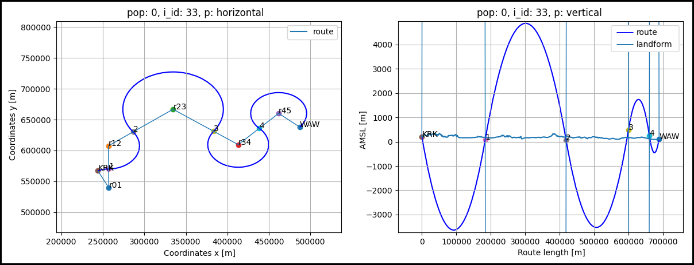
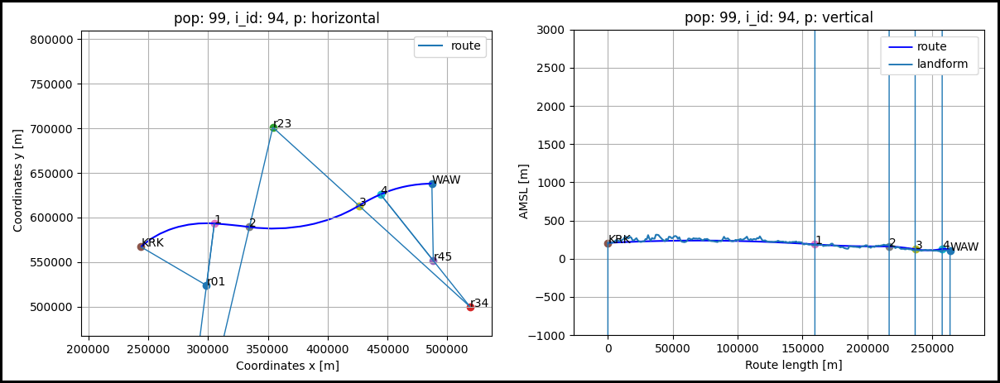
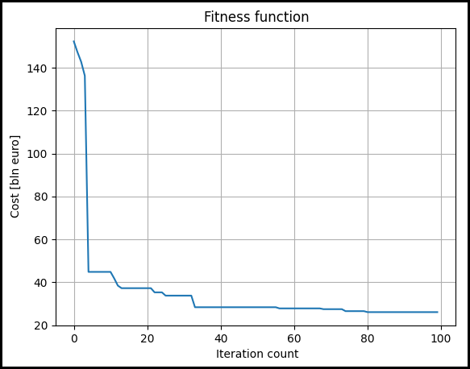

# hypgen - Hyperloop route by Genetic Algorithm

This is AI application for optimal Hyperloop route generation.

## Features

- Real geological and landform data used
- Different infrastructure types are considered: tunnels, pylons and everything in between
- Route is optimized in two planes: horizontal and vertical
- Fitness function is defined as a cost of route construction and maintenance
- Several limitations are applied to ensure solution is applicable


## Usage

```python
from genetic_algorithm.model import GAModel

model = GAModel()
model.evaluate()
```

## Example
An example route connects two cities - Cracow (_KRK_) and Warsaw (_WAW_).

### _Random solution_
In genetic algorithm solutions generated by first iteration are random.
For this reason, given solutions are not even close to the optimal one:



In below table there is summary regarding infrastructure type and total cost for randomly generated route:

| feature      | unit    | value       |
|--------------|---------|-------------|
| route length | _km_    | 692         |
| tunel        | _km_    | 390         |
| excavation   | _km_    | 1           |
| on ground    | _km_    | 2           |
| embankment   | _km_    | 0           |
| pylons       | _km_    | 299         |
| COST         | _bln €_ | 2.5 ∙ 10e23 |

### _Best solution_
In last algorithm iteration solutions are much closer to optimal one:



Summary for route after optimization:

| feature      | unit    | value |
|--------------|---------|-------|
| route length | _km_    | 268   |
| tunel        | _km_    | 138   |
| excavation   | _km_    | 24    |
| on ground    | _km_    | 11    |
| embankment   | _km_    | 35    |
| pylons       | _km_    | 60    |
| COST         | _bln €_ | 26    |

### _Fitness function_
This is how fitness function changed over iterations:



## Configuration
Configuration can be done by editing _definitions_ module:
- _config.py_ - parameters of the genetic algorithm like number of iterations, population size, composition etc.
- _types.py_ - start and end point, mesh resolution, cost and range for every type of infrastructure, route initial parameters etc.

To generate route between selected point A and B it is needed to provide geological data into _resources/geo_data/all/_.
If any locations should be treated as not allowed then they need to be added to _resources/geo_data/out_region/_.

## Technologies
Python 3.10, all used third party packages are specifies in _requirements.txt_.

## License
[MIT](https://choosealicense.com/licenses/mit/)
